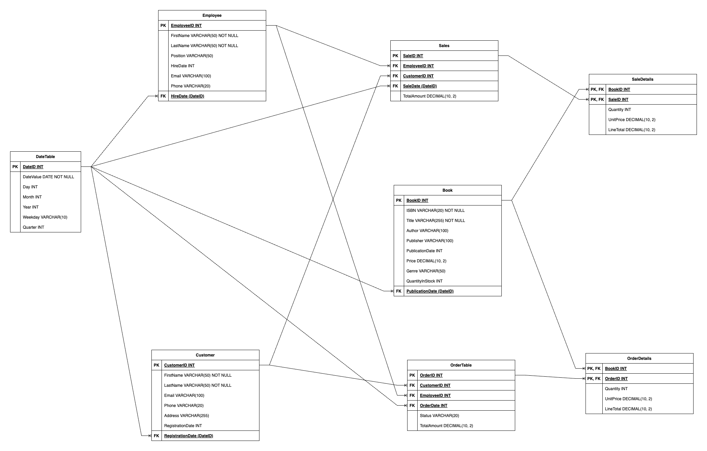
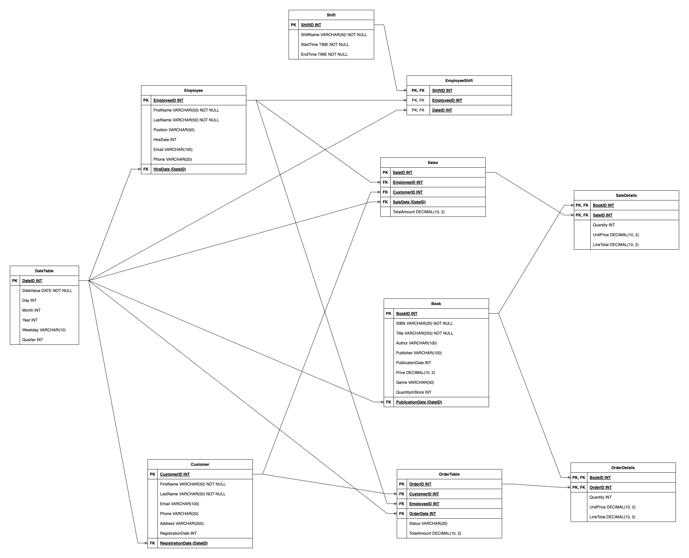

# Assignment 1: Design a Logical Model

## Question 1
Create a logical model for a small bookstore. 📚

At the minimum it should have employee, order, sales, customer, and book entities (tables). Determine sensible column and table design based on what you know about these concepts. Keep it simple, but work out sensible relationships to keep tables reasonably sized. Include a date table. There are several tools online you can use, I'd recommend [_Draw.io_](https://www.drawio.com/) or [_LucidChart_](https://www.lucidchart.com/pages/).
### Answer:

## Question 2
We want to create employee shifts, splitting up the day into morning and evening. Add this to the ERD.
### Answer:

## Question 3
The store wants to keep customer addresses. Propose two architectures for the CUSTOMER_ADDRESS table, one that will retain changes, and another that will overwrite. Which is type 1, which is type 2?

_Hint, search type 1 vs type 2 slowly changing dimensions._

Bonus: Are there privacy implications to this, why or why not?

### Answer:
### Customer Address Table Architectures: Type 1 vs Type 2

#### Architecture 1: Overwrite Changes (Type 1 SCD)

In this setup, the `CustomerAddress` table is designed to store **only the latest address** for each customer. Whenever a customer updates their address, the old address is simply replaced with the new one.

##### Table Structure: `CustomerAddress`
- **Columns:**
  - **CustomerID** (Primary Key, Foreign Key to Customer): Unique ID for each customer.
  - **AddressLine1**: Main street address.
  - **AddressLine2**: Additional address info (like an apartment number).
  - **City**
  - **State**
  - **PostalCode**: ZIP or postal code.
  - **Country**  

##### Key Characteristics
- **Primary Key**: `CustomerID` (one record per customer).
- **Overwrites Changes**: Updates the existing address whenever there's a change.
- **No History**: Old addresses are lost when updated.

**Type**: This is a **Type 1 Slowly Changing Dimension (SCD)**, since it doesn't keep any historical data.

---

#### Architecture 2: Retain Changes (Type 2 SCD)

This approach is all about **maintaining an address history** for each customer. Instead of updating an address, a new record is added to the table every time there’s a change.

##### Table Structure: `CustomerAddress`
- **Columns:**
  - **CustomerAddressID** (Primary Key): Unique identifier for each address entry.
  - **CustomerID** (Foreign Key to Customer): ID to identify the customer.
  - **AddressLine1**: Main street address.
  - **AddressLine2**: Additional info, like an apartment number.
  - **City**
  - **State**
  - **PostalCode**
  - **Country**
  - **StartDate**: When this address started being valid.
  - **EndDate**: When this address was replaced (nullable; `NULL` if it’s the current address).
  - **IsCurrent**: A flag to indicate if this is the current address.

##### Key Characteristics
- **Primary Key**: `CustomerAddressID` (each address change gets its own unique ID).
- **Retains Changes**: Inserts a new record for every address change, preserving the entire history.
- **Historical Data**: Keeps past addresses along with the periods they were valid.
- **Current Address**: Identified by an `EndDate` of `NULL` or `IsCurrent` set to TRUE.

**Type**: This is a **Type 2 Slowly Changing Dimension (SCD)**, as it retains a complete history of address changes.

---

#### Bonus: Privacy Implications

### Type 1 SCD (Overwrite Changes)
- **Minimal Privacy Concerns**: Since only the current address is stored and older addresses are overwritten, there’s less risk of keeping unnecessary personal data.
- **Compliance**: Easier to comply with data protection laws, like those that demand data minimization and the right to rectification, because outdated data isn't retained.

### Type 2 SCD (Retain Changes)
- **Increased Privacy Risks**:
  - **Data Retention**: Storing historical addresses means keeping more personal information, which could conflict with privacy regulations focused on data minimization.
  - **Data Subject Rights**: Regulations like the GDPR give individuals the right to access, change, and request the deletion of their personal data. Keeping a history of addresses can make this more complex.
  - **Security Risks**: With more personal data on file, the potential damage in case of a breach increases.
  - **Purpose Limitation**: The company must ensure that retaining historical addresses is necessary (e.g., legal reasons, analytics) and isn’t kept longer than necessary.

## Question 4
Review the AdventureWorks Schema [here](https://imgur.com/a/u0m8fX6)

Highlight at least two differences between it and your ERD. Would you change anything in yours?

### Answer:

so, I checked out the adventureworks schema and compared it to my erd. here are a couple of interesting differences i noticed:

1. **Separation of person and employee entities**: in the adventureworks schema, they have a `person` table that’s separate from `employee`. this means they can store general info about any person (like customers or contacts) without assuming they're employees. in my erd, i have separate `employee` and `customer` tables without a shared `person` entity. this is fine if employees and customers don’t overlap much, but using a `person` table like adventureworks might make it easier to manage shared attributes, like names and contact details.

2. **Product and inventory management**: adventureworks goes deeper into inventory with tables for `product`, `productcategory`, and `productinventory`. my erd is simpler, mainly focusing on books with the `book` table and a `quantityinstock` field. adventureworks’s approach adds more detail, like allowing products to belong to categories or track their location in inventory. if i think i might need more advanced inventory tracking (like categorizing books or managing their location in the store), this could be a useful addition to consider.

#### Would I change anything?
maybe! using a shared `person` table could make my model more flexible, especially if employees could become customers or vice versa. also, if i think i'll need more complex inventory management, borrowing some of the adventureworks structure might be worth it. but, if my setup is pretty straightforward, then the current design seems fine for what i need.

# Criteria

[Assignment Rubric](./assignment_rubric.md)

# Submission Information

🚨 **Please review our [Assignment Submission Guide](https://github.com/UofT-DSI/onboarding/blob/main/onboarding_documents/submissions.md)** 🚨 for detailed instructions on how to format, branch, and submit your work. Following these guidelines is crucial for your submissions to be evaluated correctly.

### Submission Parameters:
* Submission Due Date: `September 28, 2024`
* The branch name for your repo should be: `model-design`
* What to submit for this assignment:
    * This markdown (design_a_logical_model.md) should be populated.
    * Two Entity-Relationship Diagrams (preferably in a pdf, jpeg, png format).
* What the pull request link should look like for this assignment: `https://github.com/<your_github_username>/sql/pull/<pr_id>`
    * Open a private window in your browser. Copy and paste the link to your pull request into the address bar. Make sure you can see your pull request properly. This helps the technical facilitator and learning support staff review your submission easily.

Checklist:
- [x] Create a branch called `model-design`.
- [x] Ensure that the repository is public.
- [x] Review [the PR description guidelines](https://github.com/UofT-DSI/onboarding/blob/main/onboarding_documents/submissions.md#guidelines-for-pull-request-descriptions) and adhere to them.
- [x] Verify that the link is accessible in a private browser window.

If you encounter any difficulties or have questions, please don't hesitate to reach out to our team via our Slack at `#cohort-4-help`. Our Technical Facilitators and Learning Support staff are here to help you navigate any challenges.
